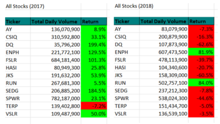
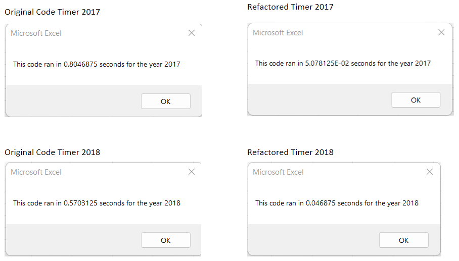

# Stock Analysis and Refactoring

## Overview of Project
The following is a brief analysis to compare the performance of 12 stocks using their total daily volume and return as well as an analysis of how refactoring the original VBA code decreased run time to allow for expanding the dataset in the future without sacrificing the speed the data is returned in.

## Results

### Stock Performance

As you can see by the above tables, 2017 was a much more profitable year in the stock market than 2018.  The only stock with a negative return in this list was TERP. The rest had significantly increased gains.  This was likely partially due to GOP tax cuts and inflated company earnings that boosted stock value across the board.  2018 was a different story. Uncertainty due to wide-spread tariffs and interest rate hikes drove returns down.  As you can see, all but two of the selected stocks had negative returns.  For more information on the stock market dive of 2018 and some of the factors that affected 2017, click [here](https://www.pbs.org/newshour/economy/making-sense/6-factors-that-fueled-the-stock-market-dive-in-2018).

### Script Performance
Originally, the script to pull this data required Excel to loop through the entire dataset (3013 rows) once for each ticker to pull starting prices, ending prices, and to calculate total volumes for each. It then stored that information until later code pulled it into another worksheet.  While this took less than a second for each year, it was only pulling data for twelve stocks.

If the recipient of this report wishes to increase the dataset and keep an eye on hundreds or thousands of stocks, that significantly increases the run time and could add up to minutes of wait time.  In a world of data at our fingertips, this is very 1995 when we would download mp3s at night because it could take hours.  In 2021, we are beyond this.

To reduce run time, I refactored the code:
- I declared "Option Explicit" at the top of the code. This forced me to declare all variables. Because I declared all variables, I was able to use the data types that made sense and used the least bytes in memory.  Undeclared variables default to variant type, which takes the most memory of the variables and, as a result, can slow code.
- I updated the code so it looped through the dataset just one time and created arrays to store the new table values in. I then pulled these values into the AllStocksAnalysis table for easy viewing.

### Effect on Run Time
The results of the above changes were significant. Running the refactored script for 2017 was 16 times faster than the original.  Running refactored script for 2018 was 12.5 times faster.

This is not very impressive when taking into consideration such a small dataset, but it makes a big difference when that dataset is expanded to tens of thousands of rows.

## Summary

### Advantages of Refactoring
As proven above, one of the biggest advantages to refactoring code is speed.  When analyzing large datasets, an inefficient script can take minutes or even hours to complete.  Rewriting it can put the data in the hands of the recipient in less time. Another advantage is that refactored code can make the code easier to follow and understand for future developers who read it.  By using intuitive comments and variable names, a developer spends less time trying to make sense of what is going on and more time doing meaningful work with it.

### Disadvantages of Refactoring
Refactoring takes more effort than writing from scratch.  When there are multiple work-arounds and bug fixes written it, refactoring can be a complicated, risky, and drawn-out process that can cost a company more money than they are willing to part with.  Timing can also be a disadvantage.  If a deadline is approaching, debugging refactored code can push a project and cause late releases. 

### Application to this Analysis
The original code for this script was an appropriate candidate for refactoring as it was fairly simple and did not include messy workarounds.  THe issue with it is that it would not have been very scalable.  The refactored code will allow for scaling up that data set without sacrificing processing time.  If there were no chance that the dataset would ever be any more than 12 stocks, it would not have been necessary to refactor it.  Stable code should not be refactored unless absolutely necessary and the original code worked as intended.  The need to scale it made it necessary for refactoring.
